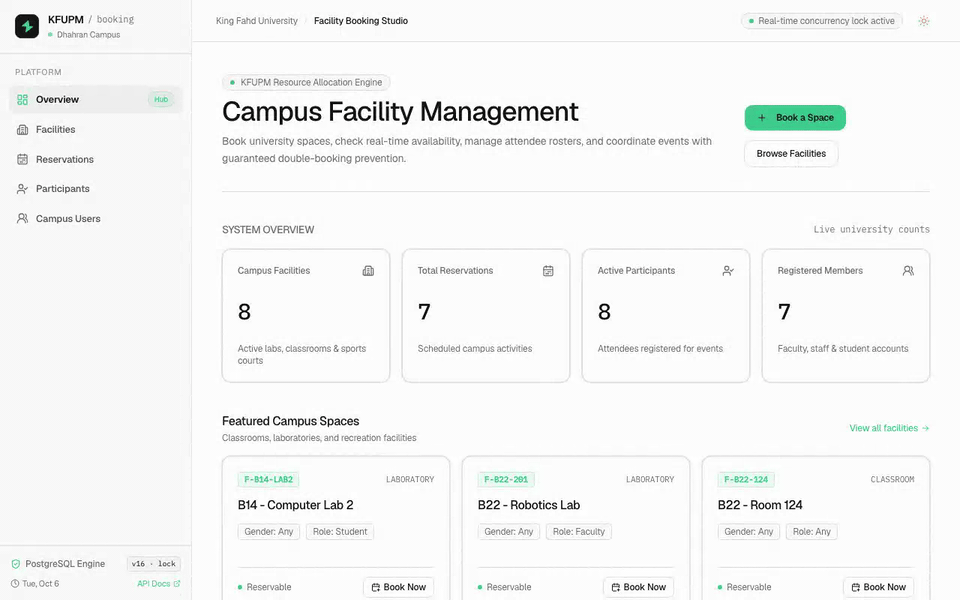

# ResourceManager



Facility booking for KFUPM. Users book shared spaces (classrooms, labs, the pool,
courts, the gym) for a time slot and invite others to join.

## Rules

- Two active reservations for the same facility cannot overlap. A booking ending
  at 12:00 and one starting at 12:00 are fine. Cancelled bookings free the slot.
- The overlap rule is a PostgreSQL constraint, so two requests at the same moment
  cannot both win.
- A facility can be limited by gender and by role. The limit applies to the booker
  and to every participant.
- A user can join a reservation once.

## Stack

- **API:** ASP.NET Core 10, EF Core 10, PostgreSQL
- **Frontend:** React 19, TypeScript, Vite, Tailwind 4, shadcn/ui

## Run locally

Needs .NET 10, PostgreSQL, and Node.

```bash
cd ResourceManager.Api
dotnet user-secrets set "ConnectionStrings:DefaultConnection" \
  "Host=localhost;Port=5432;Database=resource_managment;Username=<user>;Password=<pw>;"
dotnet run          # applies migrations and seeds sample data; docs at /scalar

cd ../frontend
npm install
npm run dev         # http://localhost:5173
```

The database role must be allowed to `CREATE EXTENSION` (the migration adds `btree_gist`).

## Test

```bash
dotnet test
```

Tests run against a real PostgreSQL and create and drop their own database. To use
another server, set `TEST_POSTGRES_CONNECTION`.

## API

`/api/facilities`, `/api/users`, `/api/reservations`, `/api/eventparticipants`

- Lists are paged: `?page=` (default 1), `?pageSize=` (default 25, max 100).
- Reservations filter by `?userId=` and `?facilityId=`. Participants filter by
  `?userId=` and `?reservationId=`.
- Errors are `ProblemDetails`: `400` bad request, `404` not found, `409` rule broken.

## Deploy

`ResourceManager.Api/Dockerfile` builds the API. Configure it with environment variables:

| Variable | Purpose |
| --- | --- |
| `ConnectionStrings__DefaultConnection` | Database. Required. |
| `Cors__AllowedOrigins__0`, `__1`, … | Frontend origins. Required in Production. |
| `ASPNETCORE_ENVIRONMENT` | `Production` turns off sample data and API docs, and logs JSON. |
| `Database__MigrateOnStartup` | Default `true`. Set `false` when running more than one instance. |
| `Database__SeedSampleData` | Default `false`. Seeds sample data outside Development. |
| `ApiDocs__Enabled` | Default `false`. Serves the Scalar docs outside Development. |

Health checks: `GET /health/live` (process is up) and `GET /health/ready` (database is reachable).

## More

- [docs/architecture.md](docs/architecture.md): design decisions and trade-offs
- [docs/backend-plan.md](docs/backend-plan.md): remaining work
